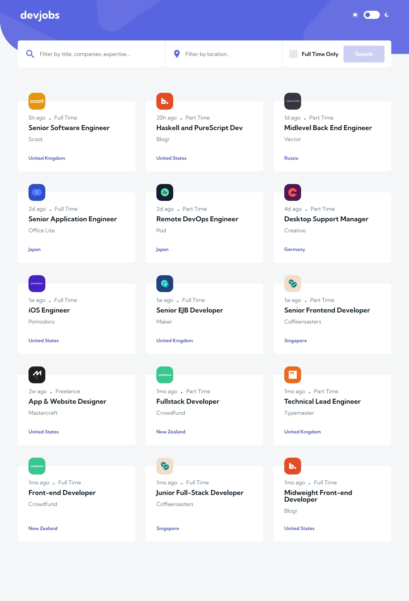

# Frontend Mentor - Devjobs web app solution

This is a solution to the [Devjobs web app challenge on Frontend Mentor](https://www.frontendmentor.io/challenges/devjobs-web-app-HuvC_LP4l). Frontend Mentor challenges help you improve your coding skills by building realistic projects.

## Table of contents

- [Overview](#overview)
  - [The challenge](#the-challenge)
  - [Screenshot](#screenshot)
  - [Links](#links)
- [My process](#my-process)
  - [Built with](#built-with)
  - [What I learned](#what-i-learned)
- [Author](#author)

## Overview

### The challenge

Users should be able to:

- View the optimal layout for each page depending on their device's screen size
- See hover states for all interactive elements throughout the site
- Be able to filter jobs on the index page by title, location, and whether a job is for a full-time position
- Be able to click a job from the index page so that they can read more information and apply for the job
- **Bonus**: Have the correct color scheme chosen for them based on their computer preferences. _Hint_: Research `prefers-color-scheme` in CSS.

### Screenshot

### Links

- Solution URL: [Add solution URL here](https://your-solution-url.com)
- Live Site URL: [Add live site URL here](https://your-live-site-url.com)

## My process

### Built with

- [Angular](https://angular.io/) - JS library
- [Angular Material](https://material.angular.io/) - UI framework
- [SCSS](https://sass-lang.com/) - For styles
- [Firebase](https://firebase.google.com/) - For backend
- CSS Grid

### What I learned

Learned a ton. It's unfortunate Firestore in Firebase has limited query configurations. I wanted to do partial matches however only pure matches are allowed. In Angular I learned a ton of new ways for implementing custom components. Creating custom form inputs through Control Value Accessors was definitly one of them. Also using Angular Fire to connect with Firebase.

## Author

- Github - [Curtis](https://github.com/webguy83)
- Frontend Mentor - [@webguy83](https://www.frontendmentor.io/profile/webguy83)
